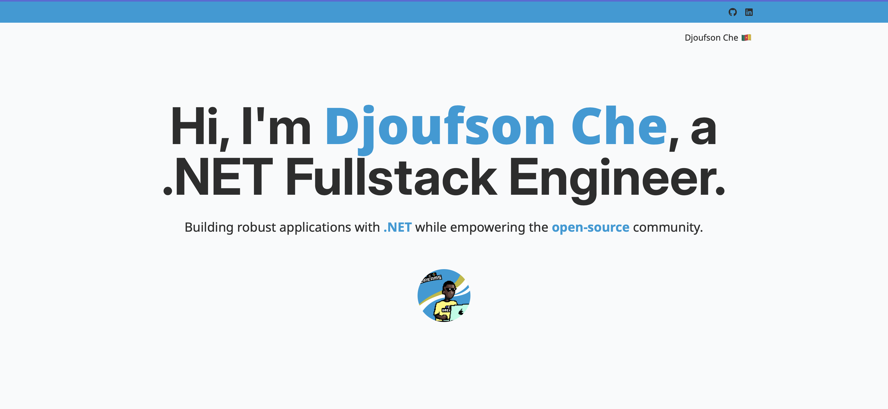

# My Personal Website



This is the source code for my personal website, built with modern web technologies to showcase my skills, projects, and professional journey. The website is implemented using **.NET 8 Blazor Server-Side Rendering (SSR)** and styled with **Tailwind CSS**.

## Table of Contents

- [Technologies Used](#technologies-used)
- [Getting Started](#getting-started)
  - [Prerequisites](#prerequisites)
  - [Installation](#installation)
  - [Running the Application](#running-the-application)
- [Contributing](#contributing)
- [License](#license)
- [Contact](#contact)

## Technologies Used

- **.NET 8 Blazor SSR**: Provides a robust and flexible framework for building server-rendered web applications.
- **Tailwind CSS**: A utility-first CSS framework for fast UI development.
- **C#**: Core programming language used for building components and server logic.

## Getting Started

### Prerequisites

- [.NET 8 SDK](https://dotnet.microsoft.com/download/dotnet/8.0) installed on your machine.
- [Node.js and npm](https://nodejs.org/) (required for Tailwind CSS).
- A code editor (e.g., [Visual Studio](https://visualstudio.microsoft.com/) or [Visual Studio Code](https://code.visualstudio.com/)).

### Installation

1. **Clone the repository**:

   ```bash
   git clone https://github.com/djoufson/website.git
   cd website
   ```

2. **Install Tailwind CSS**:

   Navigate to the project directory and run:

   ```bash
   npm install
   ```

### Running the Application

1. **Run the application**:

   ```bash
   dotnet run --project ./app
   ```

2. Open your web browser and navigate to `https://localhost:8000` to view the website.

### Development

To continuously watch for changes in Tailwind CSS during development, run:

```bash
npm run tailwind
```

## Contributing

Contributions are welcome! If you'd like to contribute to this project:

1. Fork the repository.
2. Create a new branch (`git checkout -b feature-branch`).
3. Make your changes.
4. Commit your changes (`git commit -m 'Add a new feature'`).
5. Push to the branch (`git push origin feature-branch`).
6. Open a pull request.

Please ensure your code follows the project's coding style and conventions.

## License

This project is licensed under the [MIT License](./LICENSE.txt).

## Contact

If you have any questions, suggestions, or would like to connect, feel free to reach out:

- **Email**: [djouflegran@gmail.com](mailto:djouflegran@gmail.com)
- **LinkedIn**: [Djoufson CHE BENE](https://linkedin.com/in/djoufson)
- **GitHub**: [djoufson](https://github.com/djoufson)
